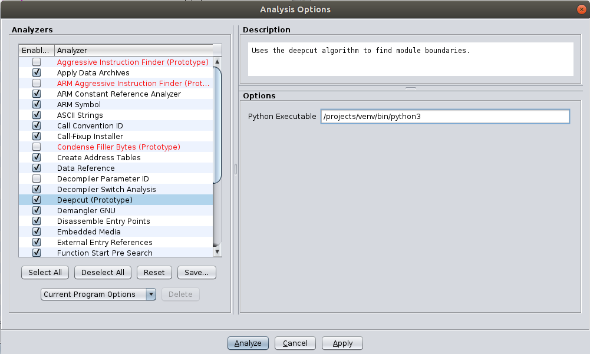
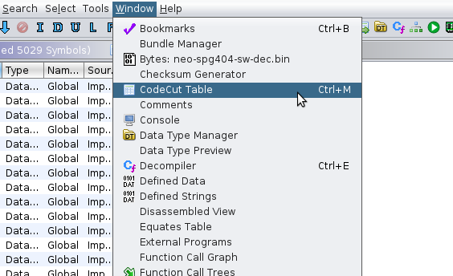
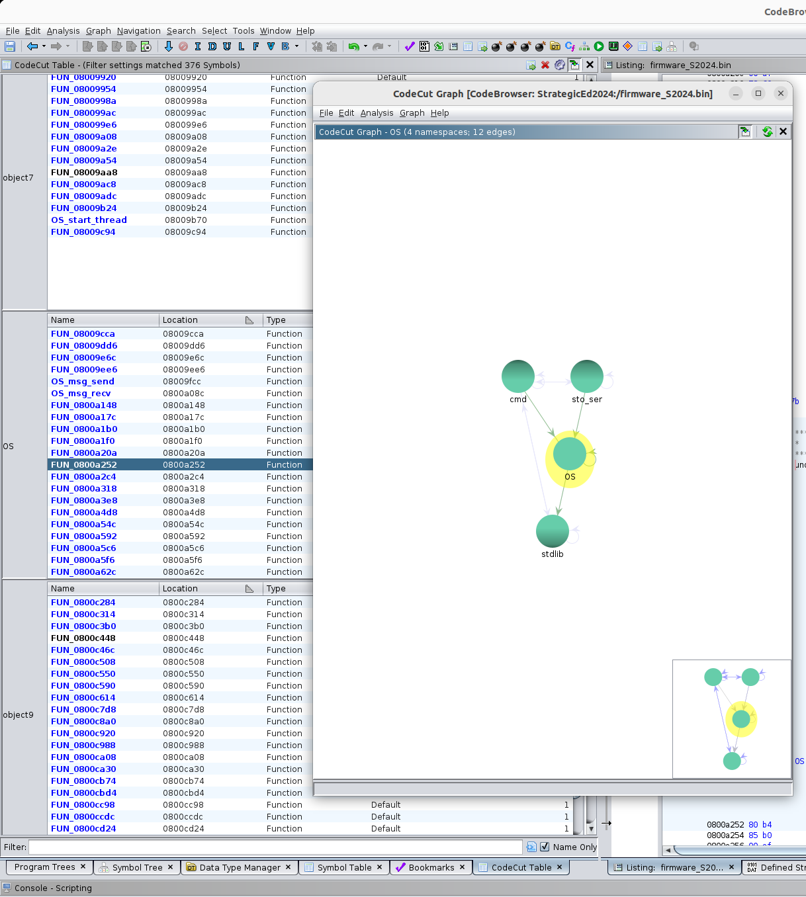

# CodeCut Plugin for Ghidra
Ghidra Plugin for DeepCut / CodeCut GUI

## Theory of Operation
CodeCut allows a user to assign functions to object files in Ghidra, and then interact with the binary at the object file level.  Functions are assigned to object files by setting the `Namespace` field in the Ghidra database.  DeepCut attempts to establish initial object file boundaries which the user can then adjust using the CodeCut Table window.

## Why Is This Useful?
Most binaries originate from multiple source code files.  When reversing, RE analysts often develop a sense of which functions are related, and therefore likely belonged to the same source file.  CodeCut allows the analyst to develop a hypothesis like "I think this block of functions are OS functions." Now if there are unexplored functions in that region, they will show up in disassembly and decompilation as OS::FUN_XXXXXXXX instead of just FUN_XXXXXXXX.  This leads to a more rapid understanding of what functions might be used for when viewed in context.

## Plugin Installation
Follow normal Ghidra extension installation procedures.  Copy the CodeCut and DeepCut extension zip into `$GHIDRA_INSTALL_DIR/Extensions` then in the main Ghidra window selection **File -> Install Extensions** and select the CodeCut and DeepCut boxes.  Ghidra will tell you it needs to restart.  Now that Ghidra only requires plugins to match the base version's major/minor and not patch versions, we expect to only release even major/minor versions.

**NOTE:** After restarting and loading a CodeBrowser window, Ghidra will tell you it has found new plugins and ask if you want to configure them.  Only CodeCut shows up in this window.  This is because DeepCut is a "one-shot" analyzer (it is still installed).

## Configuring Native Python Paths & Python Dependencies
Both CodeCut and DeepCut rely on native Python (outside of Ghidra) on your system.  CodeCut uses native Python for guessing module names.  DeepCut's model evaluation runs in native Python.  

### Native Python Dependencies
CodeCut: 
- nltk

DeepCut: 
- torch
- torch-geometric

To install dependencies run:

```
pip3 install nltk
pip3 install torch torch-geometric
```

(assuming that pip3 points to the version of Python you plan to use below)

### Configuring CodeCut Python Path

Configure the native Python path for CodeCut by choosing **Edit -> Tool Options** and selecting "Python Executable."

### Configuring DeepCut Python Path


Configure the native Python path for DeepCut by choosing **Analysis -> Analyze All Open...** and selecting **Deepcut (Prototype)**.  After changing the path, click the **Apply** button.

## Running DeepCut Analysis
DeepCut is best run as a one-shot analyzer *after* initial auto-analysis.  Select **Analysis -> One Shot -> Deepcut**.  After DeepCut runs, you can view the results by looking at the **Namespace** field in the **Symbol Table** view.

## Using CodeCut


After DeepCut runs, you can interact at an object file level with the **CodeCut Table** view.  Select **Window -> CodeCut Table** to display the table.  The CodeCut table is essentially a combined set of symbol tables, one for each module. 

You can have CodeCut guess the module names (based on string references) by choosing **Analysis -> Guess Module Names** in the CodeCut Table window.  This is helpful if your target executable has a lot of debug strings.  The name guessing script attempts to find source file names first, then falls back to strings (including bigrams and trigrams) that are repeated multiple times.

You can split/combine object files by right clicking on an object and choosing **Split Namespace Here** / **Combine Namespaces.**  You can move functions between object files (changing the boundaries of the object files) by dragging and dropping them.

## Exporting to Recompilable C

CodeCut contains two options for exporting a full module or a subrange of a module as recompilable C under the **Export** menu when you right click on a module in the CodeCut table.  This feature is marked EXPERIMENTAL and is not well-tested.

## The CodeCut Graph


CodeCut now has a graph option for viewing interactions / hierarchy of the modules within a binary.  Add namespaces to the graph view by right clicking a function in the CodeCut Table and choosing **Add Namespace to Graph**.  You can  

## Limitations

### Careful Where You Click
While it looks like you can right click on the module names on the right side, CodeCut is actually paying attention to which function is highlighted in the table.  So e.g. if you have a function in object3 highlighted and you right click on the grey object2 box to the left and click Combine/Split or Rename Namespaces, CodeCut will perform the operation from the function you have highlighted in object3.

### Address Range Peculiarities
CodeCut attempts to order the namespaces by their starting address.  CodeCut may appear to list the modules out of order, however this is usually due to disassembly irregularities from Ghidra.  E.g. let's say we have a memory map that looks like:

object2:  0x00010000 - 0x00018000
object3:  0x00018004 - 0x00020000
...
object50: 0x00480000 - 0x00480a00

Say the function at 0x00480000 makes a branch or jump to an address 0x00016008.  This should be a new function entry point, but if only one function uses it, Ghidra might not label this as a function entry point, and just consider it part of FUN_00480000.  This means that object50's actual range is 0x00016008 - 0x00480a00.  And so object50 will show up in between object2 and object3 in the table.  CodeCut outputs the module ranges into Ghidra's application log for help with debugging this.  In this case defining 0x00016008 as a function will cause object50's bounds to be the right values and object50 will show up at the right place in the table.

### Defining Functions Later
Functions that get defined after DeepCut analysis has been run are by default added to the Global namespace.  In the future we plan to add a feature that automatically adds them to the nearest namespace, or give a mechanism to more easily assign single functions directly to a specific namespace.

## Building
Specific build instructions are provided in the DeepCut and CodeCut subfolders.
